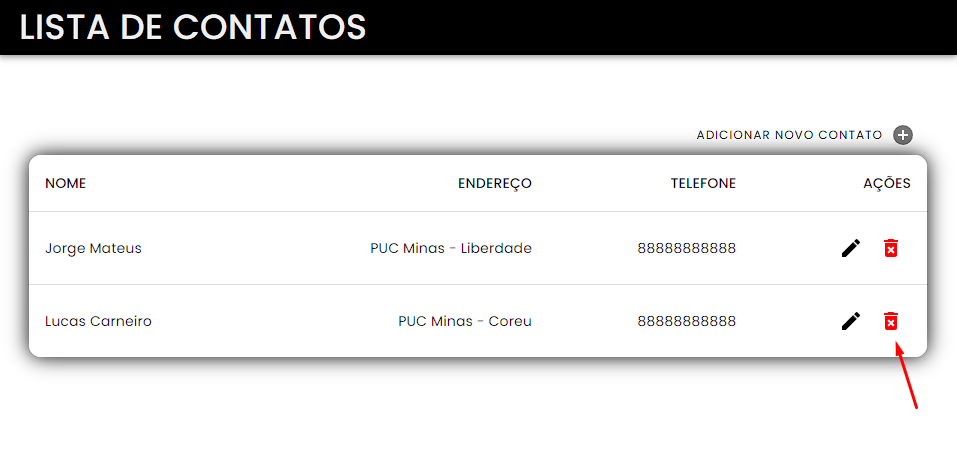
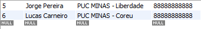
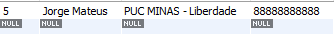
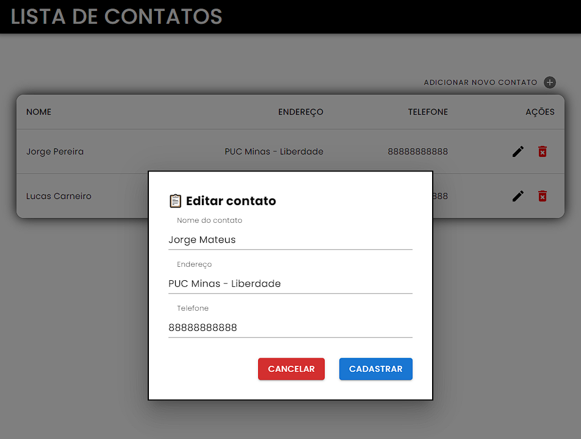
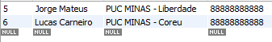
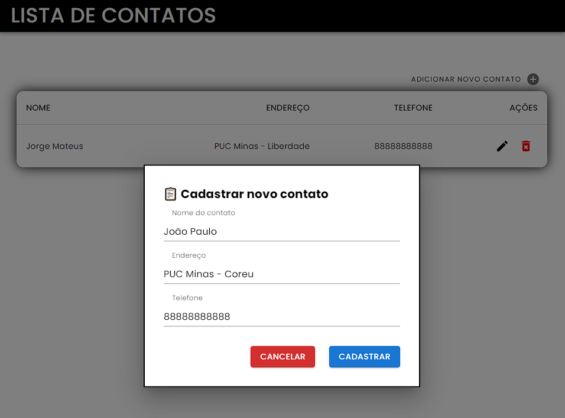
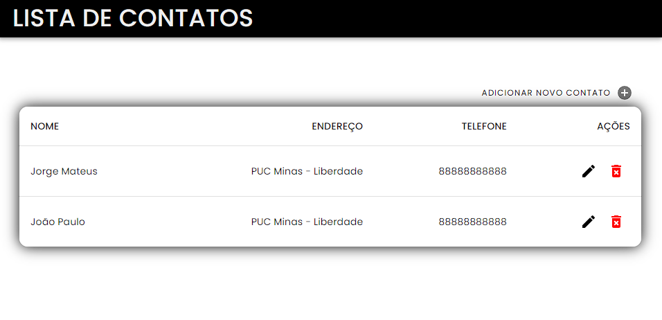
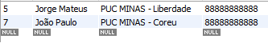

# Aplicativo - Lista de Contatos

Aplicativo de lista de contatos utilizando Hibernate.

---------------

### 🔧 **Build do Projeto - Typescript**

```bash
$ yarn create react-app contact-list --template typescript
```

### ✅ **Execução**

- `Front-End`:
```bash
$ yarn start
```

- `Back-End`: Compilado pela IDE Visual Studio Code

---------------
## 👨‍💻 **Aplicação:**

- Interface inicial:
<div align="center"> 
    
</div>

<br>
<br>

### ❌ **Remoção**:
Para remover um usuário basta clicar no lixo na linha que o contato está presente com isso ele será removido do banco e atualizado na interface.

- Interface de remoção:
<div align="center"> 
    
</div>

<br>

- Banco antes da remoção:
<div align="center"> 
    
</div>

- Banco após a remoção
<div align="center"> 
    
</div>

<br>
<hr>
<br>

### 🖊️ **Alteração**:
Para alterar o usuário clica na caneta na linha da tabela. Com isso, abre-se um modal onde o usuário poderá preencher os novos dados e assim mandar para o banco de dados.

- Interface antes da alteração:
<div align="center"> 
    
</div>

- Interface após a alteração:
<div align="center"> 
    
</div>

<br>

- Banco antes da alteração:
<div align="center"> 
    
</div>

- Banco após a alteração
<div align="center"> 
    
</div>

<br>
<hr>
<br>

### 🐦‍🔥 **Adicionar**:
Para adicionar o usuário clica no `+` acima da tabela. Com isso, abre-se um modal onde o usuário poderá preencher os dados e assim mandar para o banco de dados.

- Interface antes de adição:
<div align="center"> 
    
</div>

- Interface após a adição:
<div align="center"> 
    
</div>

<br>

- Banco antes da alteração:
<div align="center"> 
    
</div>

- Banco após a alteração
<div align="center"> 
    
</div>

